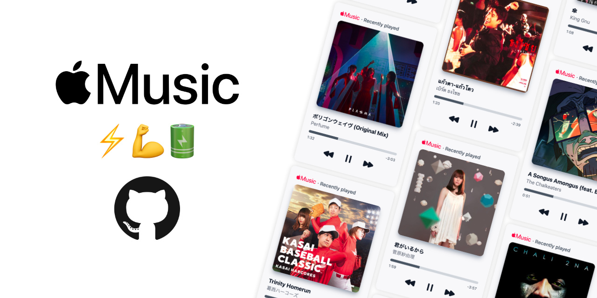

# Apple Music GitHub Profile

Show your recently plated song on Apple Music directly to your GitHub profile.

## Connect

## Themes

## FAQ

#### Why do I have to sign in with Apple ID first?
Unlike Spotfy API where you can identify user by uid, Apple Music API does not provide any possible way to identify users which will make impossible for one deployment to be used by manu people.

#### Can I use this card anywhere else?
Yes

#### I want more card styles
You can make your own theme card, and send a pull request to this repository. Please refer to [contribution guidelines]()

#### My card is broken
It possible that connected Apple Music session is already expired. You can reconnect your card by complete liking process once again.

## Credit

This project is heavily inspired by [spotify-github-profile](https://github.com/kittinan/spotify-github-profile) from [Kittinan](https://github.com/kittinan)
